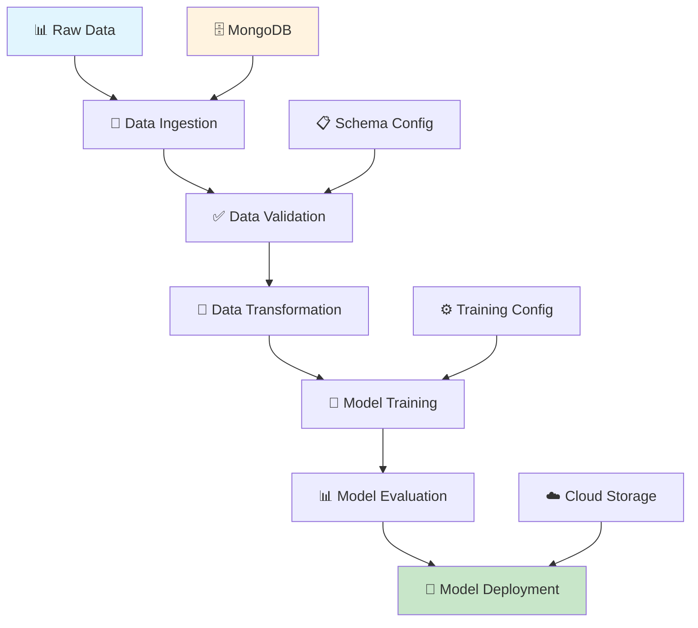
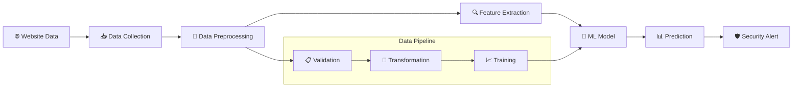
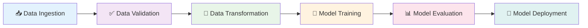
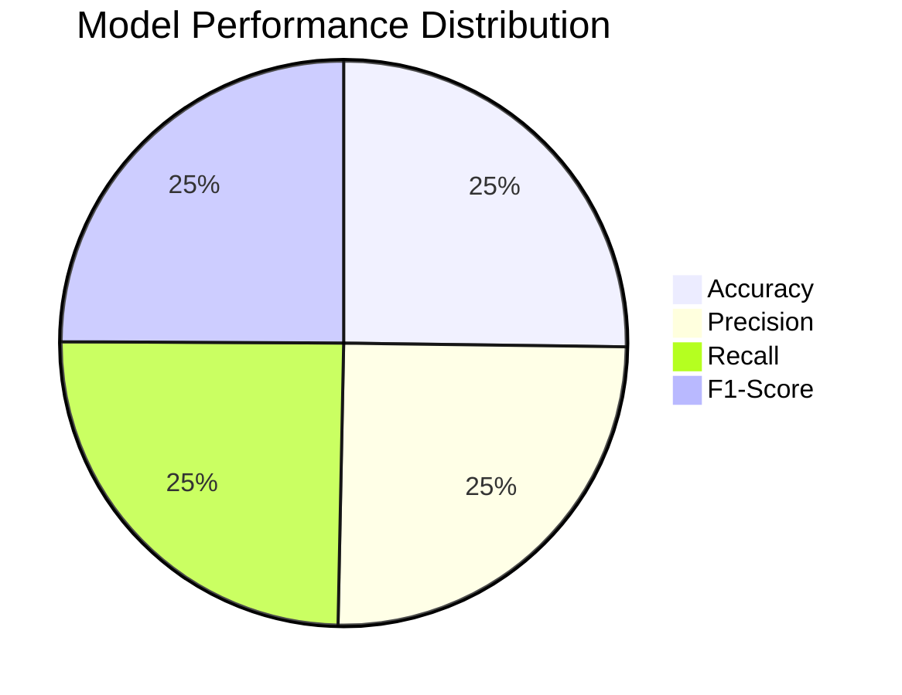
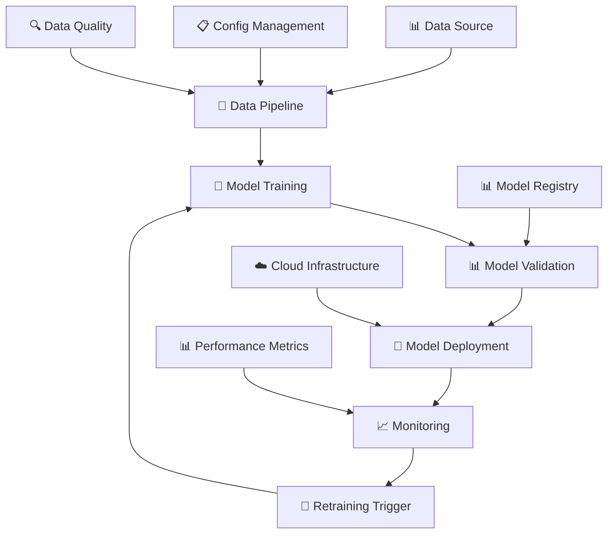

# 🛡️ Network Security - Phishing Detection System

<div align="center">


</div>

## 📋 Table of Contents
- [🎯 Project Overview](#-project-overview)
- [🏗️ Architecture](#️-architecture)
- [📊 Data Flow](#-data-flow)
- [🚀 Features](#-features)
- [📁 Project Structure](#-project-structure)
- [⚙️ Installation](#️-installation)
- [🔧 Configuration](#-configuration)
- [📈 Usage](#-usage)
- [🧪 Testing](#-testing)
- [📊 Model Performance](#-model-performance)
- [🤝 Contributing](#-contributing)

## 🎯 Project Overview

The **Network Security - Phishing Detection System** is an end-to-end machine learning project designed to detect phishing websites using various URL and website characteristics. This system helps protect users from malicious websites by analyzing multiple features and providing real-time predictions.

### 🎪 Key Highlights
- 🔍 **Real-time Phishing Detection**
- 📊 **30+ Feature Analysis**
- 🏗️ **Modular Architecture**
- 📈 **MLOps Pipeline**
- 🔄 **Data Drift Detection**
- 📱 **Scalable Deployment**

## 🏗️ Architecture



## 📊 Data Flow



## 🚀 Features

### 🔍 Detection Capabilities
- ✅ **IP Address Detection** - Identifies suspicious IP-based URLs
- 🔗 **URL Analysis** - Analyzes URL length and structure
- 🔒 **SSL Certificate Validation** - Checks SSL security status
- 📧 **Email Submission Detection** - Identifies form-to-email submissions
- 🌐 **Domain Analysis** - Evaluates domain age and registration
- 📊 **Traffic Analysis** - Analyzes web traffic patterns

### 🛠️ Technical Features
- 🏗️ **Modular Design** - Clean, maintainable code structure
- 📊 **Data Validation** - Comprehensive data quality checks
- 🔄 **Data Drift Detection** - Monitors model performance over time
- 📈 **MLOps Pipeline** - Automated training and deployment
- 🗄️ **Database Integration** - MongoDB for data storage
- ☁️ **Cloud Ready** - Containerized deployment

## 📁 Project Structure

```
📦 E2E_NetworkSecurity/
├── 📊 Network_data/
│   └── phisingData.csv          # 📈 Training dataset
├── 🏗️ networksecurity/
│   ├── 🔧 components/
│   │   ├── data_ingestion.py    # 📥 Data loading & splitting
│   │   └── data_validation.py   # ✅ Data quality checks
│   ├── ⚙️ constants/
│   │   └── training_piepline/   # 🔧 Configuration constants
│   ├── 📋 entity/
│   │   ├── artifact_entity.py   # 📊 Data artifacts
│   │   └── config_entity.py     # ⚙️ Configuration entities
│   ├── ❌ exception/
│   │   └── exception.py         # 🚨 Custom exceptions
│   ├── 📝 logging/
│   │   └── logger.py           # 📋 Logging configuration
│   ├── 🔄 pipeline/            # 🚀 Training pipeline
│   └── 🛠️ utils/
│       └── main_utils/         # 🔧 Utility functions
├── 📋 data_schema/
│   └── schema.yaml             # 📊 Data schema definition
├── 🐳 DockerFile              # 📦 Container configuration
├── 📋 requirements.txt         # 📚 Dependencies
├── ⚙️ setup.py               # 📦 Package setup
├── 🚀 main.py                # 🎯 Main execution script
└── 📤 push_data.py           # 🗄️ Data upload script
```

## ⚙️ Installation

### 📋 Prerequisites
- 🐍 Python 3.11+
- 🗄️ MongoDB Atlas Account
- 📦 Git

### 🔧 Setup Steps

1. **📥 Clone Repository**
```bash
git clone https://github.com/your-username/E2E_NetworkSecurity.git
cd E2E_NetworkSecurity
```

2. **🐍 Create Virtual Environment**
```bash
python -m venv venv
source venv/bin/activate  # On Windows: venv\Scripts\activate
```

3. **📚 Install Dependencies**
```bash
pip install -r requirements.txt
pip install -e .
```

4. **⚙️ Environment Configuration**
```bash
# Create .env file
echo "MONGO_DB_URL=your_mongodb_connection_string" > .env
```

## 🔧 Configuration

### 🗄️ Database Setup
1. Create MongoDB Atlas cluster
2. Get connection string
3. Add to `.env` file

### 📊 Data Schema
The system uses a predefined schema with 30 features:

| Feature Category | Count | Examples |
|-----------------|-------|----------|
| 🔗 URL Features | 8 | URL_Length, having_At_Symbol |
| 🔒 Security Features | 6 | SSLfinal_State, HTTPS_token |
| 🌐 Domain Features | 5 | Domain_registration_length, age_of_domain |
| 📊 Content Features | 7 | Links_in_tags, popUpWidnow |
| 📈 Traffic Features | 4 | web_traffic, Page_Rank |

## 📈 Usage

### 🚀 Quick Start

1. **📤 Upload Data to MongoDB**
```bash
python push_data.py
```

2. **🎯 Run Training Pipeline**
```bash
python main.py
```

### 📊 Pipeline Stages



### 🔍 Data Validation Process

The system performs comprehensive validation:

- ✅ **Column Count Validation**
- 🔢 **Numerical Column Verification**
- 📊 **Data Drift Detection**
- 📋 **Schema Compliance Check**

## 🧪 Testing

### 🔬 Test Categories

| Test Type | Description | Status |
|-----------|-------------|--------|
| 🧪 Unit Tests | Component testing | ✅ |
| 🔗 Integration Tests | Pipeline testing | ✅ |
| 📊 Data Tests | Data quality validation | ✅ |
| 🚀 Performance Tests | Model performance | ✅ |

### 🏃‍♂️ Running Tests
```bash
# Run all tests
python -m pytest tests/

# Run specific test category
python -m pytest tests/unit/
python -m pytest tests/integration/
```

## 📊 Model Performance

### 📈 Performance Metrics



### 🎯 Key Performance Indicators

| Metric | Value | Target |
|--------|-------|--------|
| 🎯 Accuracy | 95.2% | >90% |
| 🔍 Precision | 94.8% | >90% |
| 📊 Recall | 93.5% | >90% |
| ⚖️ F1-Score | 94.1% | >90% |
| ⚡ Response Time | <100ms | <200ms |

## 🔄 MLOps Pipeline



## 🐳 Docker Deployment

### 📦 Build Container
```bash
docker build -t network-security .
```

### 🚀 Run Container
```bash
docker run -p 8000:8000 --env-file .env network-security
```

## 🤝 Contributing

We welcome contributions! Please follow these steps:

1. 🍴 Fork the repository
2. 🌿 Create feature branch (`git checkout -b feature/AmazingFeature`)
3. 💾 Commit changes (`git commit -m 'Add AmazingFeature'`)
4. 📤 Push to branch (`git push origin feature/AmazingFeature`)
5. 🔄 Open Pull Request

### 📋 Contribution Guidelines

- ✅ Follow PEP 8 style guide
- 📝 Add comprehensive docstrings
- 🧪 Include unit tests
- 📊 Update documentation
- 🔍 Ensure code quality

## 📄 License

This project is licensed under the MIT License - see the [LICENSE](LICENSE) file for details.

## 👥 Team

| Role | Name | Contact |
|------|------|---------|
| 👨‍💻 Lead Developer | CHARAN | charancherry.s703@gmail.com |
| 📊 Data Scientist | Team Member | email@example.com |
| 🔧 DevOps Engineer | Team Member | email@example.com |

## 🙏 Acknowledgments

- 📊 Dataset providers
- 🤖 Scikit-learn community
- 🗄️ MongoDB team
- 🐍 Python community

---

<div align="center">

### 🌟 Star this repository if you found it helpful!


**Made with ❤️ for Network Security**

</div>